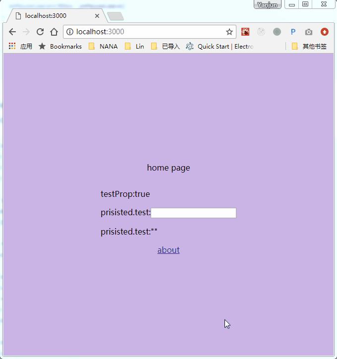

# next-page-transition

make page transition easier for next.js



## usage

components/wrapper.js

```
import w from 'next-page-transition'
import { zoomfade } from 'next-page-transition/dist/presets'

export const wrapper = w(zoomfade())
```

pages/index.js

```
import Link from 'next/link'
import wrapper from '../components/wrapper'

const Index = () => (<div>
  <p>home page</p>
  <Link href="/about"><a>about</a></Link>
</div>)

export default wrapper(Index)
```

**note** the former page is destoried by next.js so in transition the former page is a fake one without states, to prisist the states you can use [redux](https://github.com/nextjs-boilerplate/next.js-redux-helper), or [next-prisist-state](https://github.com/postor/next-prisist-state)

## test

```
git clone https://github.com/postor/next-page-transition.git
cd next-page-transition
yarn && yarn test
```

then open http://localhost:3000